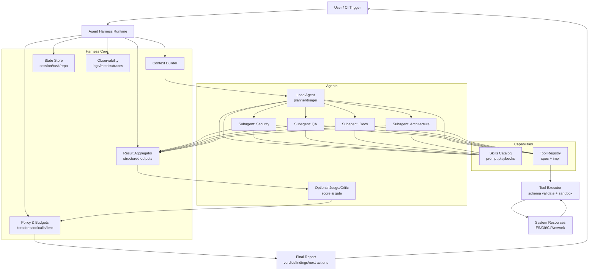
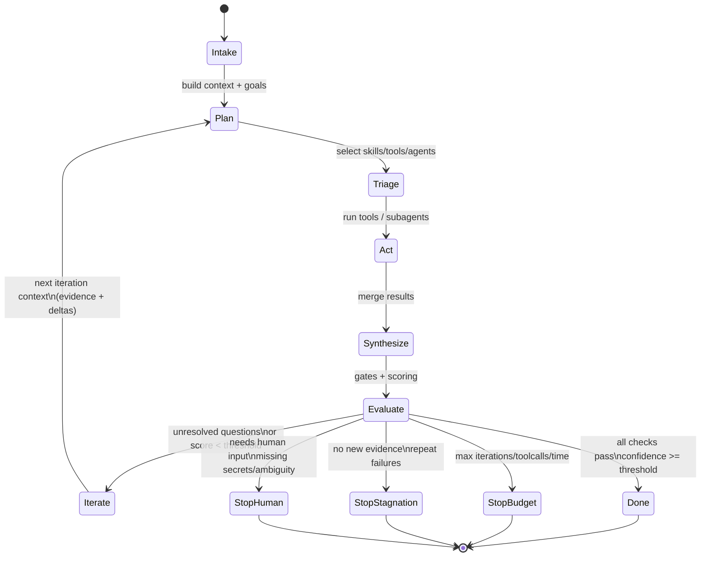
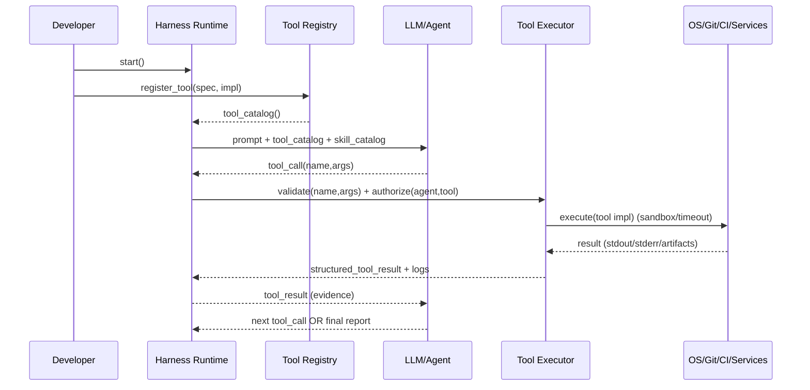
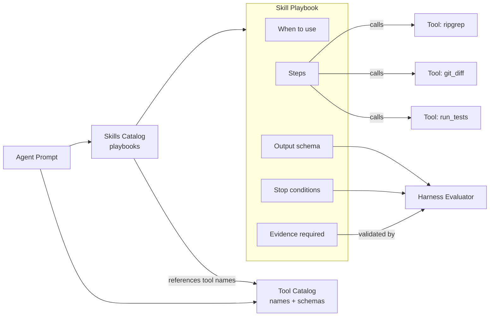
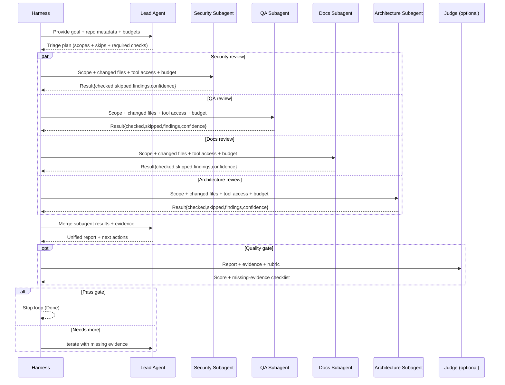

Here’s a practical “anatomy” for an agent harness that supports skills, tools, and looping, plus how to register tools, how an agent understands skills, and clear stop conditions.

1) Core building blocks

A. Runtime (the harness)

The harness is the orchestrator + execution environment. It’s responsible for:
•	building the prompt/context
•	selecting which agent(s) run
•	exposing tools
•	executing tool calls
•	collecting artifacts (plans, diffs, reports)
•	enforcing budgets + stop rules
•	persisting memory/state

Think of it as: policy + plumbing.

B. Agents

An “agent” is a configuration:
•	role/system prompt (goals, constraints, tone)
•	capabilities (which tools it may use, which skills it may invoke)
•	output contract (structured schema: report, verdict, next actions)
•	budget (max tool calls, max tokens, max wall time)
•	escalation rules (when to ask a stronger model, when to run subagents)

You typically have:
•	Primary agent (planner/decider)
•	Subagents (security, QA, docs, architecture, etc.)
•	Critic/judge (optional) to score outputs and decide whether to loop

C. Tools

Tools are executable functions the model can call (or the harness can call on its behalf):
•	filesystem reads (read_file, glob, ripgrep)
•	git diff, blame, log
•	run tests, lint, typecheck
•	query services (Snowflake, HTTP)
•	“open PR” or “comment” (if allowed)

Important: tools are code, not prompts.

D. Skills

Skills are prompt-packaged procedures (recipes) that tell an agent:
•	when to use certain tools
•	how to interpret results
•	how to structure output
•	what heuristics to apply

Skills are not executable themselves; they’re instruction modules the agent can reference. (Some ecosystems treat “skills” as tool bundles + docs; functionally: they’re capability documentation plus playbooks.)

E. State & Memory

You need state to avoid “goldfish loops”:
•	session state: conversation, tool outputs, artifacts
•	task state: plan steps, completed/failed steps, retries
•	repo state: changed files, dependency graph hints, last test run
•	memory: durable preferences, known repo conventions, past failures

2) The standard agent loop (control flow)

A solid harness loop is usually a finite-state machine:
1.	Intake
•	user request + repo snapshot metadata (branch, diff, changed files)
2.	Plan
•	agent proposes a plan and declares what to skip (triage)
3.	Act
•	call tools (gather facts, run checks, generate patches, etc.)
4.	Synthesize
•	summarize findings into a structured result (verdict, issues, fixes)
5.	Evaluate
•	judge if success criteria met; otherwise decide next iteration
6.	Stop or Iterate
•	stop if done; else loop with updated context + reduced uncertainty

Key: each loop should reduce uncertainty or increase completeness—otherwise you’re in a treadmill.

3) When to loop vs when to stop looping

Loop when:
•	you have open questions that tools can answer (missing files, failing tests)
•	you have failed checks and a clear remediation path (apply fix → rerun)
•	the output contract requires more evidence (“prove security risk is addressed”)
•	you need triangulation (e.g., security agent: changed files → dependency adjacency → sensitive sinks)

Stop when (good stops):
•	All acceptance checks pass (tests/lint/typecheck/security gates)
•	No new info is being discovered per iteration
•	Budget reached (max tool calls, tokens, wall time)
•	Repeated failure pattern detected (same error N times)
•	Human input required (missing secrets, unclear requirement, ambiguous intent)
•	Risk threshold exceeded (unsafe operation requested, destructive change)
•	Confidence plateau (e.g., score improvement < ε for 2 iterations)

A simple rule that works well:
•	Require each iteration to produce at least one of:
•	new evidence (tool output),
•	a patch/diff,
•	a reduced-risk assessment,
•	a higher score by a measurable rubric.
If not: stop.

4) Tool registration: how it works in practice

A. Tool registry

Your harness maintains a registry like:
•	ToolSpec (what the model sees)
•	name
•	description
•	input schema (JSON Schema)
•	output schema (optional but great)
•	permissions/risk level
•	ToolImpl (what actually runs)
•	function pointer / callable
•	runtime dependencies
•	sandbox rules
•	timeout limits
•	logging hooks

B. Exposure policy

Not every agent gets every tool. You want:
•	allowlist by agent
•	environment-based toggles (CI vs local)
•	“high-risk” tools (delete, push, deploy) behind explicit confirmation

C. Execution adapter

When the model emits a tool call:
•	validate args against schema
•	execute in sandbox
•	capture stdout/stderr + structured output
•	redact secrets
•	append to transcript as “tool result”
•	update state (files read, commands run, checks status)

D. Observability

Every tool call should emit:
•	correlation id
•	timing
•	exit status
•	artifact pointers (paths, logs)
This is essential for debugging loops.

5) How skills are “understood”

A good mental model:
•	Tools = what can be done
•	Skills = how to do it well

In the prompt/context, you present skills as:
•	catalog: name → purpose → when to use → steps → required tools → output format
•	selection guidance: “Prefer Skill X if you see Y”
•	constraints: “If you use Skill X, you must run Tool A then Tool B”

Skills become effective when:
•	they’re short, procedural, and strongly linked to tool names
•	they include a “stop condition” and “evidence required”
•	they define the output fields (so the harness can score them)

Example (conceptually):
•	Skill: “Security Triangulation”
•	Inputs: changed files, repo tree, dependency hints
•	Steps: find sinks/sources, trace adjacency, sample configs, run grep rules, run tests
•	Stop: no new sinks found + grep rules clean + relevant tests pass
•	Output: list of checked files + skipped files + rationale + findings severity

6) Orchestration patterns that work

Pattern 1: Single-agent + tools (simple)

One agent does plan → tool calls → report.
•	Pros: easiest
•	Cons: gets noisy, weaker specialization

Pattern 2: Lead agent + subagents (recommended)

Lead agent:
•	triages
•	assigns scopes to subagents
•	merges results
Subagents:
•	each runs its own mini loop (bounded)
•	returns structured result objects
•	must list “skipped” + why

Pattern 3: Lead agent + judge (quality gate)

Add a judge that:
•	scores completeness
•	checks contract compliance
•	triggers another loop only if score < threshold

7) Practical stop system (what I’d actually implement)

Use layered gates:
1.	Hard budgets
•	max_iterations (e.g., 5)
•	max_tool_calls (e.g., 30)
•	max_wall_time (e.g., 10 min)
2.	Deterministic gates
•	required checks pass (tests/lint/typecheck)
•	required evidence present (tool outputs attached)
3.	Stagnation detector
•	same failure signature repeats N times
•	no new files touched/read in last iteration
•	score improvement < ε twice
4.	Human-required
•	ambiguous requirement
•	missing secret/permission
•	conflicting policies

When a stop triggers, the harness should output:
•	why it stopped
•	what remains uncertain
•	exact next action for a human

8) Minimal contracts (so everything is measurable)

If you want loops to be reliable, every agent should output:
•	verdict: {merge | needs_changes | block}
•	confidence: 0–1
•	checked: list of files/tool runs performed
•	skipped: list + rationale
•	findings: [{severity, title, evidence, fix_suggestion}]
•	next_actions: ordered steps
•	artifacts: links/paths to logs, diffs, reports

This is what lets your harness decide: “loop again or stop”.

⸻

If you want, I can turn this into a drop-in “AGENTS.md” spec for your harness (skills catalog format, tool registry schema, agent result schema, and the exact loop FSM), but the above is the clean mental model and the operational details that make it actually work.
 
## Diagrams







---

## FSM Security Review - Detailed State Machine

The security review agent implements a comprehensive FSM with 6 active phases, 3 terminal states, and robust error handling.

```mermaid
stateDiagram-v2
    %% =========================
    %% FSM Security Review States
    %% =========================
    
    direction TB

    state "Security Review FSM" as fsm {
        [*] --> Intake: run_review() called
        
        %% =========================
        %% Phase States
        %% =========================
        state Intake {
            [*] --> ValidateContext
            ValidateContext --> LoadPrompt
            LoadPrompt --> ConstructMessage
            ConstructMessage --> ExecutePhase
            ExecutePhase --> ValidateOutput
            ValidateOutput --> CheckBudget
            
            note right of ValidateContext
                Required fields:
                - pr_dict
                - changes_list
            end note
            
            note right of CheckBudget
                MAX_TOOL_CALLS: 50
                MAX_ITERATIONS: 5
                MAX_SUBAGENTS: 5
            end note
        }

        state Plan_Todos {
            [*] --> ValidateContext
            ValidateContext --> LoadPrompt
            LoadPrompt --> ConstructMessage
            ConstructMessage --> ExecutePhase
            ExecutePhase --> ValidateOutput
            ValidateOutput --> PopulateTodos
            
            note right of ValidateContext
                Required fields:
                - pr_dict
                - changes_list
                - intake_output
            end note
            
            note right of PopulateTodos
                Create SecurityTodo objects
                from plan_todos data
            end note
        }

        state Delegate {
            [*] --> ValidateContext
            ValidateContext --> LoadPrompt
            LoadPrompt --> ConstructMessage
            ConstructMessage --> ExecutePhase
            ExecutePhase --> ValidateOutput
            
            note right of ValidateContext
                Required fields:
                - pr_dict
                - todos
            end note
            
            note right of ExecutePhase
                Generate subagent requests
                for delegated todos
            end note
        }

        state Collect {
            [*] --> ValidateContext
            ValidateContext --> LoadPrompt
            LoadPrompt --> ConstructMessage
            ConstructMessage --> ExecutePhase
            ExecutePhase --> ValidateOutput
            
            note right of ValidateContext
                Required fields:
                - pr_dict
                - delegate_output
                - todos
            end note
            
            note right of ExecutePhase
                Validate subagent results
                Mark TODO status
            end note
        }

        state Consolidate {
            [*] --> ValidateContext
            ValidateContext --> LoadPrompt
            LoadPrompt --> ConstructMessage
            ConstructMessage --> ExecutePhase
            ExecutePhase --> ValidateOutput
            
            note right of ValidateContext
                Required fields:
                - pr_dict
                - collect_output
                - todos
            end note
            
            note right of ExecutePhase
                Merge findings
                De-duplicate
                Synthesize summary
            end note
        }

        state Evaluate {
            [*] --> ValidateContext
            ValidateContext --> LoadPrompt
            LoadPrompt --> ConstructMessage
            ConstructMessage --> ExecutePhase
            ExecutePhase --> ValidateOutput
            
            note right of ValidateContext
                Required fields:
                - pr_dict
                - consolidate_output
                - todos
            end note
            
            note right of ExecutePhase
                Assess severity
                Generate risk assessment
                Build final report
            end note
        }

        %% =========================
        %% Terminal States
        %% =========================
        state Done {
            [*] --> BuildFinalReport
            BuildFinalReport --> ReturnReport
            
            note right of ReturnReport
                Final SecurityReviewReport:
                - findings by severity
                - risk_assessment
                - evidence_index
                - actions (required/suggested)
                - confidence (0.0-1.0)
            end note
        }

        state Stopped_Budget {
            [*] --> SetStopReason
            SetStopReason --> BuildPartialReport
            
            note right of BuildPartialReport
                Partial report with:
                - current phase
                - iterations
                - stop_reason = "stopped_budget"
            end note
        }

        state Stopped_Human {
            [*] --> SetStopReason
            SetStopReason --> BuildPartialReport
            
            note right of BuildPartialReport
                Partial report with:
                - current phase
                - iterations
                - stop_reason = "stopped_human"
            end note
        }

        %% =========================
        %% Valid Transitions (per FSM_TRANSITIONS)
        %% =========================
        Intake --> Plan_Todos: next_phase_request = "plan_todos"
        
        Plan_Todos --> Delegate: next_phase_request = "delegate"
        
        Delegate --> Collect: next_phase_request = "collect"
        Delegate --> Consolidate: next_phase_request = "consolidate"
        Delegate --> Evaluate: next_phase_request = "evaluate"
        Delegate --> Done: next_phase_request = "done"
        
        Collect --> Consolidate: next_phase_request = "consolidate"
        Collect --> Evaluate: next_phase_request = "evaluate"
        
        Consolidate --> Evaluate: next_phase_request = "evaluate"
        
        Evaluate --> Done: next_phase_request = "done"

        %% =========================
        %% Stop Gate Transitions (any phase)
        %% =========================
        Intake --> Stopped_Budget: next_phase_request = "stopped_budget"
        Intake --> Stopped_Human: next_phase_request = "stopped_human"
        Plan_Todos --> Stopped_Budget: next_phase_request = "stopped_budget"
        Plan_Todos --> Stopped_Human: next_phase_request = "stopped_human"
        Delegate --> Stopped_Budget: next_phase_request = "stopped_budget"
        Delegate --> Stopped_Human: next_phase_request = "stopped_human"
        Collect --> Stopped_Budget: next_phase_request = "stopped_budget"
        Collect --> Stopped_Human: next_phase_request = "stopped_human"
        Consolidate --> Stopped_Budget: next_phase_request = "stopped_budget"
        Consolidate --> Stopped_Human: next_phase_request = "stopped_human"
        Evaluate --> Stopped_Budget: next_phase_request = "stopped_budget"
        Evaluate --> Stopped_Human: next_phase_request = "stopped_human"

        Done --> [*]: Review complete
        Stopped_Budget --> [*]: Partial report returned
        Stopped_Human --> [*]: Partial report returned
    }

    %% =========================
    %% Execution Path Decision (AgentRuntime vs Direct LLM)
    %% =========================
    state "Execution Path" as exec_path {
        [*] --> CheckRuntime
        CheckRuntime --> AgentRuntimePath: agent_runtime is not None
        CheckRuntime --> DirectLLMPath: agent_runtime is None
        
        state AgentRuntimePath {
            [*] --> GetSession
            GetSession --> ExecuteAgent
            ExecuteAgent --> ExtractResponse
            ExtractResponse --> ParseJSON
            ParseJSON --> [*]
            
            note right of GetSession
                session_id = "security_review_fsm"
                session_manager.get_session()
            end note
            
            note right of ExecuteAgent
                agent_runtime.execute_agent(
                    agent_name,
                    session_id,
                    user_message
                )
            end note
        }
        
        state DirectLLMPath {
            [*] --> CreateLLMClient
            CreateLLMClient --> GetDefaultAccount
            GetDefaultAccount --> CompleteRequest
            CompleteRequest --> ExtractResponse
            ExtractResponse --> StripMarkdown
            StripMarkdown --> ParseJSON
            ParseJSON --> [*]
            
            note right of CreateLLMClient
                LLMClient(
                    provider_id,
                    model,
                    api_key
                )
            end note
            
            note right of CompleteRequest
                temperature = 0.3
                system_prompt + user_message
            end note
            
            note right of StripMarkdown
                Handle ```json...``` wrapping
                Extract JSON content
            end note
        }
    }

    %% =========================
    %% Error Handling Flow
    %% =========================
    state "Error Handling" as error_flow {
        [*] --> ExecutePhase
        ExecutePhase --> PhaseOutputReturned: Phase successful
        ExecutePhase --> NoneReturned: Phase failed (None)
        ExecutePhase --> BudgetExceeded: Budget exceeded
        ExecutePhase --> RuntimeError: Runtime error
        ExecutePhase --> JSONDecodeError: Invalid JSON
        ExecutePhase --> ValidationError: Pydantic validation fail
        ExecutePhase --> FSMPhaseError: Invalid transition
        ExecutePhase --> MissingContextError: Missing required fields
        ExecutePhase --> MissingPromptError: Missing phase prompt
        
        NoneReturned --> BuildPartialReport
        BudgetExceeded --> BuildPartialReport
        RuntimeError --> BuildPartialReport
        JSONDecodeError --> InvalidPhaseOutputError
        ValidationError --> BuildPartialReport
        FSMPhaseError --> RaiseError
        MissingContextError --> RaiseError
        MissingPromptError --> RaiseError
        
        BuildPartialReport --> [*]
        RaiseError --> [*]
        
        note right of BuildPartialReport
            stop_reason includes:
            - "phase_name_failed"
            - "budget_exceeded"
            - "validation_failed"
            - "malformed_output"
        end note
        
        note right of RaiseError
            Explicit errors:
            - FSMPhaseError (invalid transition)
            - MissingPhaseContextError (missing fields)
            - MissingPhasePromptError (missing prompt section)
            - InvalidPhaseOutputError (JSON parsing failed)
            - BudgetExceededError (budget limits hit)
        end note
    }

    %% =========================
    %% Phase Context Validation
    %% =========================
    state "PhaseContext Validation" as context_val {
        [*] --> PhaseContext: Create PhaseContext object
        
        PhaseContext --> ValidateIntake: phase = "intake"
        PhaseContext --> ValidatePlanTodos: phase = "plan_todos"
        PhaseContext --> ValidateDelegate: phase = "delegate"
        PhaseContext --> ValidateCollect: phase = "collect"
        PhaseContext --> ValidateConsolidate: phase = "consolidate"
        PhaseContext --> ValidateEvaluate: phase = "evaluate"
        PhaseContext --> UnknownPhase: phase not recognized
        
        ValidateIntake --> CheckFields: Required: pr_dict, changes_list
        ValidatePlanTodos --> CheckFields: Required: pr_dict, changes_list, intake_output
        ValidateDelegate --> CheckFields: Required: pr_dict, todos
        ValidateCollect --> CheckFields: Required: pr_dict, delegate_output, todos
        ValidateConsolidate --> CheckFields: Required: pr_dict, collect_output, todos
        ValidateEvaluate --> CheckFields: Required: pr_dict, consolidate_output, todos
        
        CheckFields --> AllPresent: All fields exist and not None
        CheckFields --> MissingFields: Any field missing or None
        
        AllPresent --> [*]
        MissingFields --> MissingPhaseContextError
        UnknownPhase --> ValueError
        
        MissingPhaseContextError --> [*]
        ValueError --> [*]
        
        note right of MissingPhaseContextError
            "Missing required fields for phase 'X': A, B, C. 
             Required fields: [list]"
        end note
    }

    %% =========================
    %% Transition Validation Logic
    %% =========================
    state "Transition Validation" as trans_val {
        [*] --> CheckNextPhaseRequest
        CheckNextPhaseRequest --> IsNone: next_phase_request is None
        CheckNextPhaseRequest --> NotString: not isinstance(str)
        CheckNextPhaseRequest --> NotValidValue: not in valid_phases
        CheckNextPhaseRequest --> ValidValue: in valid_phases
        
        IsNone --> FSMPhaseError: "Phase X returned None for next_phase_request"
        NotString --> FSMPhaseError: "Invalid type for next_phase_request"
        NotValidValue --> FSMPhaseError: "Unexpected next_phase_request"
        
        ValidValue --> IsStopState: In (stopped_budget, stopped_human)
        ValidValue --> IsDone: == "done"
        ValidValue --> IsRegularPhase: Other valid phase
        
        IsStopState --> SetStopPhase
        SetStopPhase --> SetStopReason
        SetStopReason --> [*]
        
        IsDone --> ValidateDoneTransition
        ValidateDoneTransition --> Allowed: Allowed from current phase
        ValidateDoneTransition --> NotAllowed: Not allowed from current phase
        
        Allowed --> SetDonePhase
        SetDonePhase --> SetStopReason
        SetStopReason --> [*]
        
        NotAllowed --> FSMPhaseError: "Invalid transition from X to done"
        
        IsRegularPhase --> CheckFSMTransitions
        CheckFSMTransitions --> InAllowedList: In FSM_TRANSITIONS[from_phase]
        CheckFSMTransitions --> NotInAllowedList: Not in FSM_TRANSITIONS[from_phase]
        
        InAllowedList --> UpdatePhase
        UpdatePhase --> IncrementIterations
        IncrementIterations --> [*]
        
        NotInAllowedList --> FSMPhaseError: "Invalid transition from X to Y"
        
        note right of FSM_TRANSITIONS
            {
                "intake": ["plan_todos"],
                "plan_todos": ["delegate"],
                "delegate": ["collect", "consolidate", "evaluate", "done"],
                "collect": ["consolidate"],
                "consolidate": ["evaluate"],
                "evaluate": ["done"]
            }
        end note
    }

    %% =========================
    %% Session Lifecycle
    %% =========================
    state "Session Management" as session_lifecycle {
        [*] --> GetSession
        GetSession --> SessionExists: session already exists
        GetSession --> CreateSession: session not exists
        
        SessionExists --> UseExistingSession
        CreateSession --> UseNewSession
        
        UseExistingSession --> ExecutePhase
        UseNewSession --> ExecutePhase
        
        ExecutePhase --> PhaseComplete: Phase completed successfully
        ExecutePhase --> PhaseFailed: Phase failed with error
        
        PhaseComplete --> ReleaseSession
        PhaseFailed --> ReleaseSession
        
        ReleaseSession --> [*]
        
        note right of GetSession
            session_manager.get_session(
                "security_review_fsm"
            )
        end note
        
        note right of ReleaseSession
            session.release_session(session_id)
            Must be called in all paths
        end note
    }

    %% =========================
    %% Connections between subsystems
    %% =========================
    fsm --> exec_path: Uses _execute_phase()
    exec_path --> error_flow: Error paths
    fsm --> context_val: Uses _validate_phase_context()
    fsm --> trans_val: Uses _transition_to_phase()
    fsm --> session_lifecycle: Session lifecycle
```

### Key FSM Components

**States (9 total)**
- **Active Phases (6)**: `intake`, `plan_todos`, `delegate`, `collect`, `consolidate`, `evaluate`
- **Terminal States (3)**: `done`, `stopped_budget`, `stopped_human`

**Valid Transitions**
```python
FSM_TRANSITIONS = {
    "intake": ["plan_todos"],
    "plan_todos": ["delegate"],
    "delegate": ["collect", "consolidate", "evaluate", "done"],
    "collect": ["consolidate"],
    "consolidate": ["evaluate"],
    "evaluate": ["done"],
}
```

**Budget Limits**
- `MAX_TOOL_CALLS`: 50
- `MAX_ITERATIONS`: 5
- `MAX_SUBAGENTS`: 5

**Error Types**
- `FSMPhaseError`: Invalid phase transition
- `BudgetExceededError`: Budget limits hit
- `InvalidPhaseOutputError`: JSON/schema validation failed
- `MissingPhaseContextError`: Required fields missing
- `MissingPhasePromptError`: Phase prompt section missing/empty
