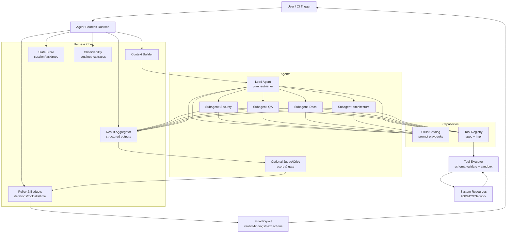
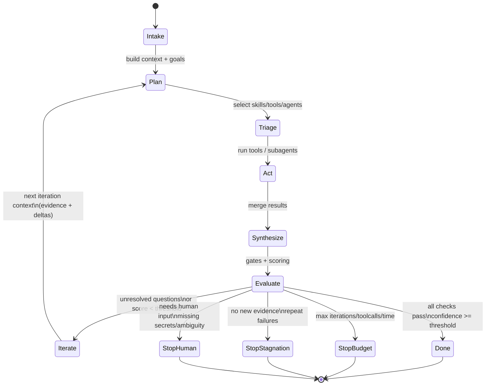
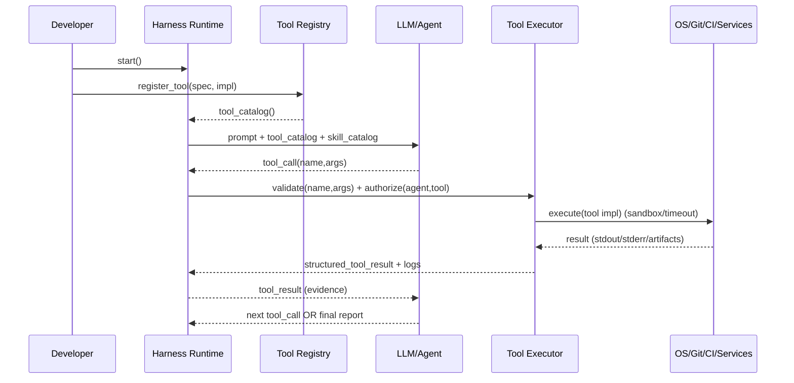
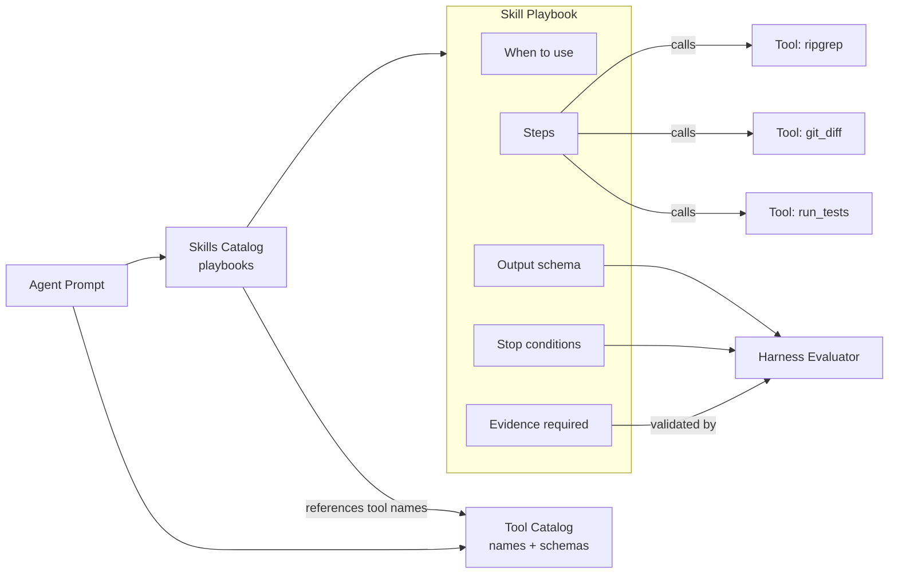
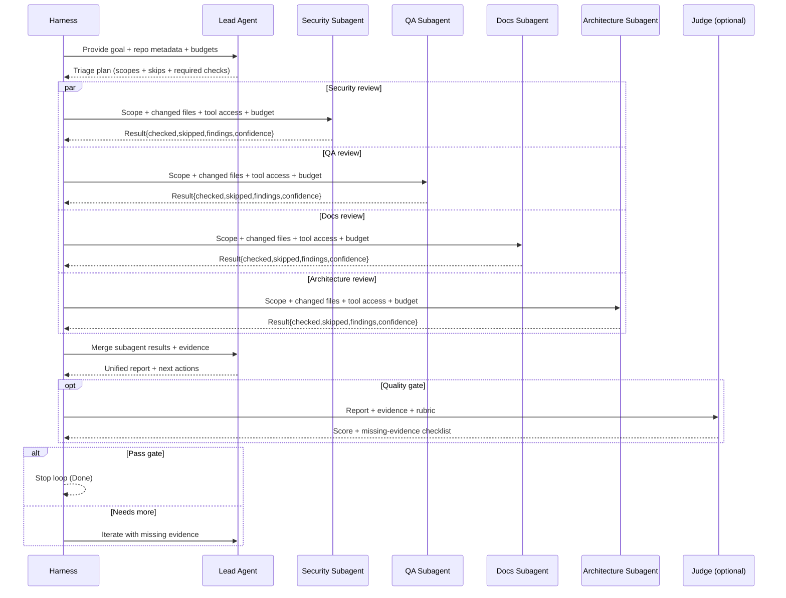

Here’s a practical “anatomy” for an agent harness that supports skills, tools, and looping, plus how to register tools, how an agent understands skills, and clear stop conditions.

1) Core building blocks

A. Runtime (the harness)

The harness is the orchestrator + execution environment. It’s responsible for:
•	building the prompt/context
•	selecting which agent(s) run
•	exposing tools
•	executing tool calls
•	collecting artifacts (plans, diffs, reports)
•	enforcing budgets + stop rules
•	persisting memory/state

Think of it as: policy + plumbing.

B. Agents

An “agent” is a configuration:
•	role/system prompt (goals, constraints, tone)
•	capabilities (which tools it may use, which skills it may invoke)
•	output contract (structured schema: report, verdict, next actions)
•	budget (max tool calls, max tokens, max wall time)
•	escalation rules (when to ask a stronger model, when to run subagents)

You typically have:
•	Primary agent (planner/decider)
•	Subagents (security, QA, docs, architecture, etc.)
•	Critic/judge (optional) to score outputs and decide whether to loop

C. Tools

Tools are executable functions the model can call (or the harness can call on its behalf):
•	filesystem reads (read_file, glob, ripgrep)
•	git diff, blame, log
•	run tests, lint, typecheck
•	query services (Snowflake, HTTP)
•	“open PR” or “comment” (if allowed)

Important: tools are code, not prompts.

D. Skills

Skills are prompt-packaged procedures (recipes) that tell an agent:
•	when to use certain tools
•	how to interpret results
•	how to structure output
•	what heuristics to apply

Skills are not executable themselves; they’re instruction modules the agent can reference. (Some ecosystems treat “skills” as tool bundles + docs; functionally: they’re capability documentation plus playbooks.)

E. State & Memory

You need state to avoid “goldfish loops”:
•	session state: conversation, tool outputs, artifacts
•	task state: plan steps, completed/failed steps, retries
•	repo state: changed files, dependency graph hints, last test run
•	memory: durable preferences, known repo conventions, past failures

2) The standard agent loop (control flow)

A solid harness loop is usually a finite-state machine:
1.	Intake
•	user request + repo snapshot metadata (branch, diff, changed files)
2.	Plan
•	agent proposes a plan and declares what to skip (triage)
3.	Act
•	call tools (gather facts, run checks, generate patches, etc.)
4.	Synthesize
•	summarize findings into a structured result (verdict, issues, fixes)
5.	Evaluate
•	judge if success criteria met; otherwise decide next iteration
6.	Stop or Iterate
•	stop if done; else loop with updated context + reduced uncertainty

Key: each loop should reduce uncertainty or increase completeness—otherwise you’re in a treadmill.

3) When to loop vs when to stop looping

Loop when:
•	you have open questions that tools can answer (missing files, failing tests)
•	you have failed checks and a clear remediation path (apply fix → rerun)
•	the output contract requires more evidence (“prove security risk is addressed”)
•	you need triangulation (e.g., security agent: changed files → dependency adjacency → sensitive sinks)

Stop when (good stops):
•	All acceptance checks pass (tests/lint/typecheck/security gates)
•	No new info is being discovered per iteration
•	Budget reached (max tool calls, tokens, wall time)
•	Repeated failure pattern detected (same error N times)
•	Human input required (missing secrets, unclear requirement, ambiguous intent)
•	Risk threshold exceeded (unsafe operation requested, destructive change)
•	Confidence plateau (e.g., score improvement < ε for 2 iterations)

A simple rule that works well:
•	Require each iteration to produce at least one of:
•	new evidence (tool output),
•	a patch/diff,
•	a reduced-risk assessment,
•	a higher score by a measurable rubric.
If not: stop.

4) Tool registration: how it works in practice

A. Tool registry

Your harness maintains a registry like:
•	ToolSpec (what the model sees)
•	name
•	description
•	input schema (JSON Schema)
•	output schema (optional but great)
•	permissions/risk level
•	ToolImpl (what actually runs)
•	function pointer / callable
•	runtime dependencies
•	sandbox rules
•	timeout limits
•	logging hooks

B. Exposure policy

Not every agent gets every tool. You want:
•	allowlist by agent
•	environment-based toggles (CI vs local)
•	“high-risk” tools (delete, push, deploy) behind explicit confirmation

C. Execution adapter

When the model emits a tool call:
•	validate args against schema
•	execute in sandbox
•	capture stdout/stderr + structured output
•	redact secrets
•	append to transcript as “tool result”
•	update state (files read, commands run, checks status)

D. Observability

Every tool call should emit:
•	correlation id
•	timing
•	exit status
•	artifact pointers (paths, logs)
This is essential for debugging loops.

5) How skills are “understood”

A good mental model:
•	Tools = what can be done
•	Skills = how to do it well

In the prompt/context, you present skills as:
•	catalog: name → purpose → when to use → steps → required tools → output format
•	selection guidance: “Prefer Skill X if you see Y”
•	constraints: “If you use Skill X, you must run Tool A then Tool B”

Skills become effective when:
•	they’re short, procedural, and strongly linked to tool names
•	they include a “stop condition” and “evidence required”
•	they define the output fields (so the harness can score them)

Example (conceptually):
•	Skill: “Security Triangulation”
•	Inputs: changed files, repo tree, dependency hints
•	Steps: find sinks/sources, trace adjacency, sample configs, run grep rules, run tests
•	Stop: no new sinks found + grep rules clean + relevant tests pass
•	Output: list of checked files + skipped files + rationale + findings severity

6) Orchestration patterns that work

Pattern 1: Single-agent + tools (simple)

One agent does plan → tool calls → report.
•	Pros: easiest
•	Cons: gets noisy, weaker specialization

Pattern 2: Lead agent + subagents (recommended)

Lead agent:
•	triages
•	assigns scopes to subagents
•	merges results
Subagents:
•	each runs its own mini loop (bounded)
•	returns structured result objects
•	must list “skipped” + why

Pattern 3: Lead agent + judge (quality gate)

Add a judge that:
•	scores completeness
•	checks contract compliance
•	triggers another loop only if score < threshold

7) Practical stop system (what I’d actually implement)

Use layered gates:
1.	Hard budgets
•	max_iterations (e.g., 5)
•	max_tool_calls (e.g., 30)
•	max_wall_time (e.g., 10 min)
2.	Deterministic gates
•	required checks pass (tests/lint/typecheck)
•	required evidence present (tool outputs attached)
3.	Stagnation detector
•	same failure signature repeats N times
•	no new files touched/read in last iteration
•	score improvement < ε twice
4.	Human-required
•	ambiguous requirement
•	missing secret/permission
•	conflicting policies

When a stop triggers, the harness should output:
•	why it stopped
•	what remains uncertain
•	exact next action for a human

8) Minimal contracts (so everything is measurable)

If you want loops to be reliable, every agent should output:
•	verdict: {merge | needs_changes | block}
•	confidence: 0–1
•	checked: list of files/tool runs performed
•	skipped: list + rationale
•	findings: [{severity, title, evidence, fix_suggestion}]
•	next_actions: ordered steps
•	artifacts: links/paths to logs, diffs, reports

This is what lets your harness decide: “loop again or stop”.

⸻

If you want, I can turn this into a drop-in “AGENTS.md” spec for your harness (skills catalog format, tool registry schema, agent result schema, and the exact loop FSM), but the above is the clean mental model and the operational details that make it actually work.
 
## Diagrams

